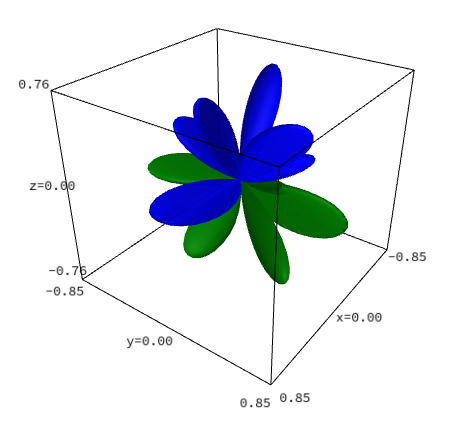

# Hemisphärische Kugelflächenfunktionen

  
  
<em>Abbildung 42: Visualisierung der hemisphärischen Kugelflächenfunktion für l=4 und m=2 </em>

Dieses Projekt enthält eine Implementierung zur Berechnung und Visualisierung von hemisphärischen Kugelflächenfunktionen (Hemispherical Harmonics) unter Verwendung von SageMath. Mehr Informationen dazu findest du unter [Hemisphärische Kugelflächenfunktionen](https://gwr-mbh.de/hemisphericalharmonics/).

## Installation

Voraussetzung ist eine funktionierende Installation von [SageMath](https://www.sagemath.org/).
